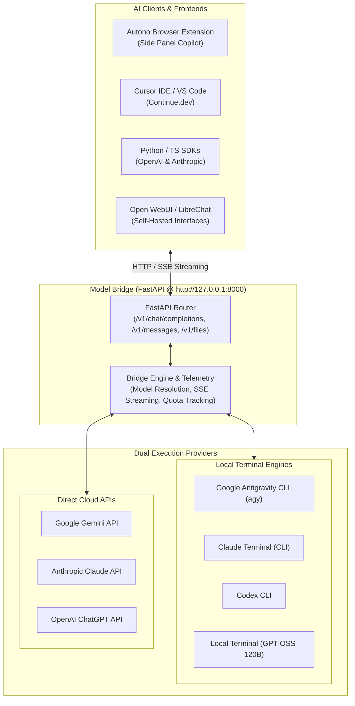

# Model Bridge

<div align="center">
  <h3>⚡ High-Performance Local Gateway for Google Antigravity, Anthropic Claude & OpenAI Models</h3>
  <p>
    
    
    
    
    
    
  </p>
  <p>
    <em>Universal local gateway connecting AI browser extensions, developer tools, and custom scripts to frontier AI models with zero unnecessary overhead.</em>
  </p>
</div>

---

## 🌟 Overview

**Model Bridge** is an open-source, local FastAPI server that exposes industry-standard API endpoints (`/v1/chat/completions`, `/v1/responses`, `/v1/messages`, `/v1/models`, `/v1/files`). It acts as a bidirectional bridge between client applications and underlying local CLI tools or official provider APIs:

1. **Google Antigravity & Gemini**:
   - **Local Terminal**: Powered by the local Antigravity CLI (`agy`) and `google-antigravity` SDK.
   - **Gemini API**: Direct execution for Google Gemini models via Gemini API Key.
   - *Models*: Gemini 3.8 Flash, Gemini 3.7 Flash, Gemini 3.6 Flash, Gemini 3.1 Pro.
2. **Anthropic Claude**:
   - **Local Terminal**: Local CLI execution via Claude Terminal environment.
   - **Claude API**: Direct connection using Anthropic API Key.
   - *Models*: Claude Sonnet 5.5, Claude Opus 5.5, Claude Fable 5.1, Claude Haiku 4.5, Claude Sonnet 4.6, Claude Opus 4.6.
3. **OpenAI & Codex**:
   - **Local Terminal**: Local CLI execution via Codex CLI environment.
   - **ChatGPT API**: Direct connection using OpenAI API Key.
   - *Models*: GPT-6 Astra, GPT-6 Sol, GPT-6 Luna, GPT-5.6 Terra, GPT-5.6 Sol, GPT-5.6 Luna.
4. **GPT-OSS 120B**:
   - Local terminal execution or direct execution via OpenAI API (strictly isolated from Gemini API).

---

## 🏗️ Architecture



---

## 🚀 Features

- **Standard OpenAI API Compatibility**:
  - `POST /v1/chat/completions`: Full support for Server-Sent Events (`stream: true`) and non-streaming responses.
  - `POST /v1/responses`: OpenAI Responses API structure.
  - `GET /v1/models` and `GET /v1/models/{model_id}`: Live model registry with capability annotations.
  - `POST /v1/files`, `GET /v1/files`, `DELETE /v1/files/{file_id}`: Multimodal document and image uploads.
- **Anthropic Claude Agent SDK Compatibility**:
  - `POST /v1/messages`: Drop-in replacement for the official `anthropic-python` SDK (`base_url="http://127.0.0.1:8000"`).
  - `POST /v1/claude/agent`: Autonomous web automation agent execution with tool calling (click, type, navigate, screenshot).
  - Extended thinking / Chain-of-Thought token budget handling (`thinking: {"type": "enabled", "budget_tokens": ...}`).
- **Dual Runtime Modes**:
  - **Modern GUI**: Intuitive CustomTkinter desktop interface with live start/stop button, active metrics, and request logs.
  - **Headless Server**: Run in continuous server/CI mode using `python main.py --headless`.
- **CORS Enabled**: Configured for local cross-origin browser extensions, local webapps, and sandboxes.
- **Zero Paid Key Requirement**: Uses your active local Antigravity authentication session when running in Local Terminal mode.

---

## 📦 Prerequisites & Quick Start

### 1. Prerequisites
- **Python 3.10+** installed on your system.
- **Git** installed.
- *(Optional)* [Google Antigravity CLI](https://antigravity.google) installed if utilizing local Antigravity execution.

### 2. Installation

```bash
# Clone the repository
git clone https://github.com/MatiasV3B/ModelBridge.git
cd ModelBridge

# Create and activate a virtual environment
python -m venv .venv

# On Windows:
.venv\Scripts\activate

# On Linux/macOS:
source .venv/bin/activate

# Install dependencies
pip install -r requirements.txt
```

### 3. Launching the Bridge

#### Option A: Headless Mode (CLI / Server / Container)
```bash
python main.py --headless --host 127.0.0.1 --port 8000
```

#### Option B: Windows GUI
```powershell
python main.py
# Or double-click: Iniciar-AntigravityBridge.bat
```

#### Option C: Silent Background Service (Windows)
Double-click `Iniciar-Servicio-Fondo.bat` (to stop, run `Detener-Servicio-Fondo.bat`).

---

## 🔌 Client Integration Examples

Once the server is running on `http://127.0.0.1:8000`:

### 1. Autono Browser Extension
In the [Autono](https://github.com/MatiasV3B/Autono) side panel:
- Open **Settings** → **Bridge Connection**.
- Bridge URL: `http://127.0.0.1:8000`.
- Verify the green status indicator (`🟢 Bridge Connected`).

### 2. Python OpenAI SDK
```python
from openai import OpenAI

client = OpenAI(
    base_url="http://127.0.0.1:8000/v1",
    api_key="sk-antigravity",  # Any non-empty string in Local Terminal mode
)

stream = client.chat.completions.create(
    model="gemini-3.8-flash-medium",
    messages=[
        {"role": "system", "content": "You are a helpful software architect."},
        {"role": "user", "content": "Explain reactive stream architectures concisely."},
    ],
    stream=True,
)

for chunk in stream:
    text = chunk.choices[0].delta.content or ""
    print(text, end="", flush=True)
```

### 3. Python Anthropic SDK
```python
from anthropic import Anthropic

client = Anthropic(
    base_url="http://127.0.0.1:8000",
    api_key="sk-antigravity",
)

message = client.messages.create(
    model="claude-sonnet-5-5",
    max_tokens=1024,
    messages=[
        {"role": "user", "content": "Analyze this code structure for performance bottlenecks."}
    ],
)
print(message.content[0].text)
```

### 4. Cursor IDE / Continue.dev
In your `config.json`:
```json
{
  "models": [
    {
      "title": "Antigravity Gemini 3.8",
      "provider": "openai",
      "model": "gemini-3.8-flash-medium",
      "apiBase": "http://127.0.0.1:8000/v1",
      "apiKey": "sk-antigravity"
    }
  ]
}
```

### 5. cURL Request
```bash
curl http://127.0.0.1:8000/v1/chat/completions \
  -H "Content-Type: application/json" \
  -H "Authorization: Bearer sk-antigravity" \
  -d '{
    "model": "gemini-3.8-flash-medium",
    "messages": [{"role": "user", "content": "Say hello!"}]
  }'
```

---

## 📡 API Reference

| Endpoint | Method | Description |
| :--- | :--- | :--- |
| `/health` | `GET` | Server status, version, and active engine configuration |
| `/v1/chat/completions` | `POST` | OpenAI-compatible chat completion (streaming SSE & sync) |
| `/v1/responses` | `POST` | OpenAI Responses API format |
| `/v1/messages` | `POST` | Anthropic Messages API format |
| `/v1/claude/agent` | `POST` | Autonomous web task execution agent |
| `/v1/models` | `GET` | List all available models across providers |
| `/v1/models/{model_id}` | `GET` | Retrieve specific model details and metrics |
| `/v1/files` | `POST` | Upload images, documents, and code files |
| `/v1/files` | `GET` | List active session files |
| `/api/metrics` | `GET` | Live telemetry, request logs, and token counters |

---

## 🤝 Contributing

Contributions are welcome! Please check our [Contributing Guidelines](CONTRIBUTING.md) and [Code of Conduct](CODE_OF_CONDUCT.md).

1. Fork the repository.
2. Create your feature branch (`git checkout -b feat/my-improvement`).
3. Commit your changes (`git commit -m 'feat: add support for custom provider'`).
4. Push to the branch (`git push origin feat/my-improvement`).
5. Open a Pull Request.

---

## 📄 License

Distributed under the MIT License. See [`LICENSE`](LICENSE) for details.
